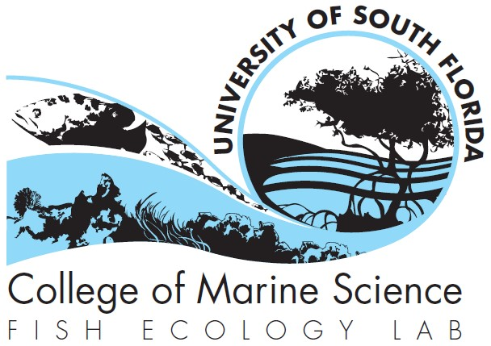

--- 
title: Student Guide to Success
author: Dr. Chris Stallings
site: bookdown::bookdown_site
output: bookdown::gitbook
link-citations: yes
colorlinks: yes
description: "The lab handbook for the USF CMS Fish Ecology Lab directed by Christopher
  Stallings."
urlcolor: blue
cover-image: Images/FEL.jpg
---

``` {r echo = FALSE}
file.create('docs/.nojekyll')
```

# *Welcome to the Fish Ecology Lab at <br/> the USF College of Marine Science* {.unlisted .unnumbered}

```{r out.width = '65%', fig.align='center', echo=FALSE}

```

<br/>

Making the transition from being an undergrad to a graduate student can be both rewarding and exciting, but also has its challenges. Although you are considered a graduate “student,” you will be treated like a professional. Thus, you will have to balance being a student and developing your skills (after all, that’s why you are here), while also being treated as a colleague in the profession. This means that you will learn many new techniques and skills, but are expected to take charge of your learning and be the master of your own path. You will begin to contribute novel information to your scientific field. This guide is intended to help you make this transition so that you can excel here at USF and prepare yourself for a successful and rewarding career. I request that you review this handbook at the beginning of every semester since some advice is specific to different stages of your time as a graduate student.

You should also read and understand the CMS Student Handbook: [Master's Student](https://usf.app.box.com/s/2ew6pwdre3jkexgv8fgdwo8ticnvr7cc) or [Doctoral Student](https://usf.app.box.com/s/mapv44nebi90iz7y9rjprsekcwps1yua)

Additional information is also available from the [USF Office of Graduate Studies](https://www.usf.edu/graduate-studies/).

***

**Contributors:**  
*Timothy Pusack, Ileana Freytis-Ortiz, Dinorah Chacin-Amorena, Jonathan Peake*

**Bookdown code:**  
*Michael Schram*

**Last Updated:**  
*`r Sys.Date()`*

***